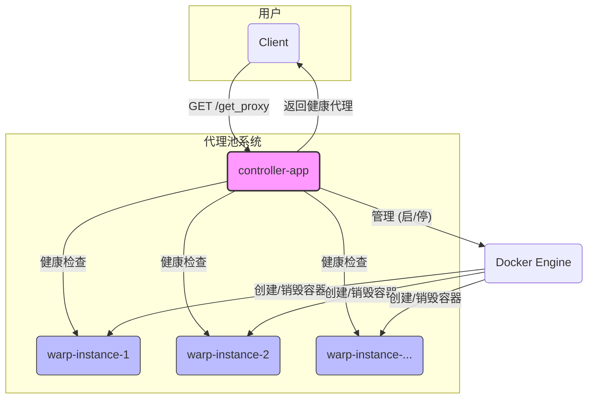

# WARP 高可用代理池

[](https://www.python.org/) [](https://www.docker.com/) [](https://fastapi.tiangolo.com/) [](https://opensource.org/licenses/MIT)

一个基于 `warp-cli` 构建的、动态管理、高可用的 SOCKS5/HTTP 代理池。本项目使用 Docker 和 Python (FastAPI) 实现，旨在提供一个稳定、易于扩展的 WARP 代理解决方案。

## ✨ 核心特性

- **动态实例管理**: 根据 `config.yaml` 自动创建和管理多个 WARP 代理实例，无需手动修改 `docker-compose.yml`。
- **高可用性**: 主控程序自动对代理池进行周期性健康检查，并剔除故障节点，确保 API 始终返回可用代理。
- **RESTful API**: 提供简单易用的 API，用于获取可用代理和监控代理池状态。
- **易于部署与扩展**: 基于 Docker 和 Docker Compose，一条命令即可完成部署；修改配置文件即可轻松扩展代理实例数量。
- **支持 WARP+**: 通过环境变量轻松配置 WARP+ 许可证密钥。

## 🏗️ 系统架构

项目由两部分组成：`主控程序 (controller-app)` 和 `WARP 实例 (warp-instance)`。



- **controller-app**: FastAPI 应用，作为系统的大脑。它负责：
  1.  解析 `config.yaml`，通过 Docker SDK 动态启动所需数量的 `warp-instance` 容器。
  2.  周期性地对所有 `warp-instance` 进行健康检查。
  3.  提供 API 接口，供客户端获取最健康的代理。
- **warp-instance**: 运行 `warp-cli` 的容器，提供 SOCKS5 和 HTTP 代理服务。

## 🚀 快速开始

#### 1. 环境准备

- [Docker](https://docs.docker.com/get-docker/)
- [Docker Compose](https://docs.docker.com/compose/install/)

#### 2. 项目配置

a. **克隆项目**:
   ```bash
   git clone https://github.com/your-repo/warppool.git
   cd warppool
   ```

b. **配置 WARP+ (可选)**:
   如果你有 WARP+ 许可证密钥，创建一个 `.env` 文件：
   ```ini
   # .env
   WARP_LICENSE_KEY=xxxxxxxx-xxxxxxxx-xxxxxxxx
   ```
   系统会自动加载此密钥。

c. **配置代理实例**:
   打开 `controller-app/config.yaml`，根据需求配置代理实例数量和端口。

   ```yaml
   # controller-app/config.yaml
   warp_instances:
     - name: "warp-instance-1"
       socks5_port: 9091
       http_proxy_port: 8081
     - name: "warp-instance-2"
       socks5_port: 9092
       http_proxy_port: 8082
     # - ...可以继续添加更多实例

   health_checker:
     timeout_seconds: 10
     check_urls:
       - "https://www.cloudflare.com/cdn-cgi/trace"
       - "https://ip.gs"
   ```

#### 3. 启动服务

只需启动主控程序，它会自动管理 WARP 实例：
```bash
docker-compose up --build -d controller-app
```

#### 4. 验证服务

- **查看容器状态**:
  ```bash
  docker ps
  ```
  你会看到 `proxy-pool-controller` 以及 `config.yaml` 中定义的所有 `warp-instance-*` 容器正在运行。

- **查看日志**:
  ```bash
  docker-compose logs -f controller-app
  ```
  日志会显示 WARP 实例的启动和健康检查过程。

## 📚 API 文档

API 服务监听于 `http://localhost:8000`。

| 端点             | 方法 | 描述                                   | 成功响应 (示例)                                                              | 失败响应 (示例)                                       |
| ---------------- | ---- | -------------------------------------- | ---------------------------------------------------------------------------- | ----------------------------------------------------- |
| `/`              | GET  | 检查服务是否正在运行。                 | `{"message": "WARP Proxy Pool is running!"}`                                 | -                                                     |
| `/get_proxy`     | GET  | 获取一个当前可用的健康代理地址。       | `{"proxy": "socks5://127.0.0.1:9091"}`                                        | `{"detail": "No healthy proxies available."}` (503)   |
| `/status`        | GET  | 获取所有代理实例的详细状态。           | `{"warp-instance-1": {"status": "healthy", "latency_ms": 120}, "warp-instance-2": {"status": "unhealthy"}}` | -                                                     |

## 💡 使用示例

#### 使用 `curl` 测试代理

你可以通过 `curl` 命令使用获取到的 SOCKS5 代理访问网络。

1.  **获取代理**:
    ```bash
    PROXY_URL=$(curl -s http://localhost:8000/get_proxy | sed -n 's/.*"proxy": "\(.*\)".*/\1/p')
    echo "使用代理: $PROXY_URL"
    ```

2.  **通过代理访问**:
    ```bash
    curl --proxy $PROXY_URL https://www.cloudflare.com/cdn-cgi/trace
    ```

#### 在终端中设置代理

```bash
export ALL_PROXY=$(curl -s http://localhost:8000/get_proxy | sed -n 's/.*"proxy": "\(.*\)".*/\1/p')

# 现在你的终端命令（如 git, curl）将通过该代理
git clone https://github.com/...
```

## 🔧 停止服务

```bash
docker-compose down
```
该命令会停止并移除主控程序和所有由它创建的 WARP 实例容器。

## 🌟 后续优化建议

- **高级调度策略**: 实现基于延迟的最低延迟调度或基于 IP 的轮询。
- **Web UI**: 使用 Streamlit 或一个简单的前端框架为 `/status` 页面创建一个更友好的可视化界面。
- **日志持久化**: 将日志输出到文件或发送到日志聚合服务（如 ELK, Loki）。
- **安全性**: 为 API 接口添加认证（如 API Key）。