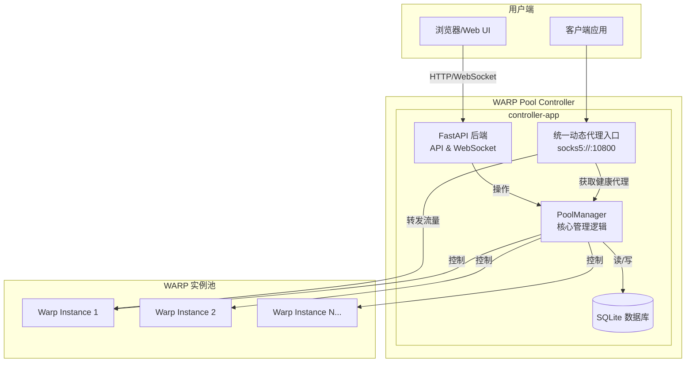

# WARP 代理池管理器重构方案

## 1. 概述

本文档旨在为 `controller-app` 提供一个详细的重构方案。当前应用是一个基于 API 的代理池管理器，虽然功能稳定，但缺乏图形化界面和动态管理能力。本次重构的核心目标是将其转变为一个拥有现代化 Web 界面的、支持运行时动态管理 WARP 实例的强大工具。

## 2. 现有架构分析

### 2.1. 组件

-   **`main.py`**: 基于 FastAPI 的 API 入口。
-   **`pool_manager.py`**: 核心业务逻辑，管理代理池、健康检查和自动恢复。
-   **`warp_controller.py`**: 通过与 Docker API 交互来控制 WARP 容器。
-   **`health_checker.py`**: 负责检查代理的连通性和性能。
-   **`config.yaml`**: 静态配置文件，用于定义 WARP 实例。

### 2.2. 优劣势

-   **优势**: 模块化、自动恢复机制健壮、易于容器化部署。
-   **劣势**: 无图形化界面、配置静态（无法动态增删实例）、状态非持久化（内存存储）、管理功能有限。

## 3. 重构目标

1.  **图形化界面 (GUI)**: 提供一个直观的 Web 界面来监控和管理代理池。
2.  **动态实例管理**: 支持在运行时通过 GUI 添加、删除、修改 WARP 实例，无需重启服务。
3.  **功能增强的 API**: 扩展 API 以支持 GUI 的所有操作。
4.  **状态持久化**: 使用数据库存储实例配置和状态，确保数据在服务重启后不丢失。

### 4.1. 后端 (Backend)

-   **框架**: 继续使用 **FastAPI**。
-   **数据库**: 引入 **SQLite** 和 **SQLAlchemy ORM** 进行数据持久化。
-   **API**:
    -   提供完整的 CRUD API 用于管理实例。
    -   增加 WebSocket 端点 (`/ws/status`) 以实时推送状态。
-   **核心逻辑**: 重构 `PoolManager` 以从数据库动态加载和管理实例。

### 4.2. 前端 (Frontend)

-   **框架**: 采用 **Vue.js** 和 **TailwindCSS** 构建一个现代化的、响应式的单页应用 (SPA)。
-   **功能**:
    -   实例仪表盘：实时展示所有实例的状态、IP、延迟等。
    -   实例操作：提供添加、编辑、删除、手动重连、手动检查等功能。
    -   实时更新：通过 WebSocket 接收后端推送，动态更新界面。

### 4.3. 统一动态代理入口 (Unified Dynamic Proxy Entrypoint)

-   **目标**: 提供一个单一、稳定的代理地址 (`socks5://controller-app:10800`)，客户端无需关心后端代理池的动态变化。
-   **实现**: 在 `controller-app` 内部，创建一个轻量级的 SOCKS5 代理服务器。
-   **逻辑**:
    1.  该服务器监听一个固定端口。
    2.  当收到连接请求时，它会向 `PoolManager` 请求一个当前健康的代理地址。
    3.  然后，它将客户端的流量转发给选中的健康 WARP 实例。
    4.  如果转发失败，它可以自动重试下一个健康实例。

### 4.4. 新架构图



## 5. 详细设计

### 5.1. 新项目结构

```
warppool/
├── docker-compose.yml
├── README.md
├── REFACTOR_PLAN.md  # 本文件
├── controller-app/
│   ├── Dockerfile
│   ├── requirements.txt
│   ├── alembic/              # [新增] 数据库迁移
│   ├── alembic.ini           # [新增] Alembic 配置
│   ├── app/                  # [新增] 后端应用主目录
│   │   ├── __init__.py
│   │   ├── main.py           # FastAPI 入口
│   │   ├── crud.py           # [新增] 数据库操作
│   │   ├── dynamic_proxy.py  # [新增] 统一动态代理入口
│   │   ├── database.py       # [新增] 数据库设置
│   │   ├── models.py         # [新增] SQLAlchemy 模型
│   │   ├── schemas.py        # [新增] Pydantic 模型
│   │   ├── pool_manager.py   # [重构]
│   │   ├── health_checker.py
│   │   └── warp_controller.py
│   └── data/                 # [新增] 存放 SQLite 数据库文件
│       └── .gitkeep
├── frontend/                 # [新增] 前端 Vue.js 应用
│   └── ...
└── warp-instance/
    └── ...
```

### 5.2. 数据库模型 (`models.py`)

```python
from sqlalchemy import Column, Integer, String, Boolean
from .database import Base

class WarpInstance(Base):
    __tablename__ = "warp_instances"

    id = Column(Integer, primary_key=True, index=True)
    name = Column(String, unique=True, index=True, nullable=False)
    socks5_port = Column(Integer, unique=True, nullable=False)
    # 可以增加更多配置项，如自定义设备名等
    is_managed = Column(Boolean, default=True)
```

### 5.3. API 设计

| Method | Endpoint                               | Description                      |
| :----- | :------------------------------------- | :------------------------------- |
| `GET`    | `/api/instances`                       | 获取所有实例列表及其状态         |
| `POST`   | `/api/instances`                       | 添加一个新实例                   |
| `GET`    | `/api/instances/{instance_id}`         | 获取单个实例的详细信息           |
| `PUT`    | `/api/instances/{instance_id}`         | 更新实例配置                     |
| `DELETE` | `/api/instances/{instance_id}`         | 删除一个实例                     |
| `POST`   | `/api/instances/{instance_id}/reconnect` | 手动触发实例重连                 |
| `POST`   | `/api/instances/{instance_id}/check`   | 手动触发实例健康检查             |
| `WS`   | `/ws/status`                           | WebSocket 实时状态推送           |

## 6. 实施步骤 (TODO List)

1.  **[ ] 环境与后端基础搭建**
    -   [ ] 调整 `controller-app` 目录结构，创建 `app` 目录。
    -   [ ] 更新 `requirements.txt`，添加 `sqlalchemy`, `alembic`, `websockets`。
    -   [ ] 实现 `database.py`, `models.py`, `schemas.py`, `crud.py`。
    -   [ ] 使用 `alembic` 初始化数据库并创建第一个迁移版本。

2.  **[ ] 后端业务逻辑重构**
    -   [ ] 重构 `PoolManager`，使其从数据库加载实例，并支持动态增删。
    -   [ ] 在 `main.py` 中实现所有新的 RESTful API 端点。
    -   [ ] 实现 WebSocket (`/ws/status`)，并在 `PoolManager` 状态更新时推送消息。
    -   [ ] 移除对 `config.yaml` 的依赖。

3.  **[ ] 实现统一动态代理入口**
    -   [ ] 在 `dynamic_proxy.py` 中实现一个轻量级 SOCKS5 代理。
    -   [ ] 将其与 `PoolManager` 集成，以获取健康实例。
    -   [ ] 在 `main.py` 中作为后台任务启动。

4.  **[ ] 前端开发 (Vue.js + TailwindCSS)**
    -   [ ] 初始化 Vue.js 项目到 `frontend` 目录，并集成 **TailwindCSS**。
    -   [ ] 创建主视图，通过 WebSocket 连接后端。
    -   [ ] 开发实例卡片/列表组件，用于展示实时状态。
    -   [ ] 开发实例增/删/改的表单和模态框。
    -   [ ] 实现与后端 API 的交互逻辑。

5.  **[ ] Docker 与部署**
    -   [ ] 更新 `controller-app/Dockerfile`，增加启动时运行 `alembic upgrade head` 的命令。
    -   [ ] 更新 `docker-compose.yml`：
        -   添加 `frontend` 服务。
        -   为 `controller-app` 添加 volume 以持久化 SQLite 数据库 (`./controller-app/data:/app/data`)。
        -   在 `docker-compose.yml` 中为 `controller-app` 暴露统一代理入口的端口（如 `10800:10800`）。
        -   (可选) 配置一个反向代理（如 Nginx）来统一服务前后端。

6.  **[ ] 测试与文档**
    -   [ ] 编写集成测试，确保前后端协同工作正常。
    -   [ ] 更新 `README.md`，包含新架构的介绍和部署说明。